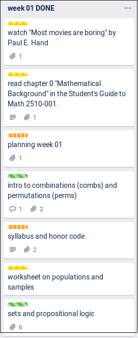

Your name (print clearly in capital letters): \underline{\hspace{9.2cm}}

This is both a self-assessment for you and a report of progress for our class. Please **return this assessment to Colton by 8:50am**. 
I am collecting this assessment because I'd like to invite you to share: 

- what you accomplished, 
- what you struggled with, and 
- how you are doing in the course overall.

Recall that in-class participation, reading, problem sets count for about $3/10$ of your grade in this course. Since this is the first week (and there are around $15$ weeks this term), the work you did this week should be worth about $3/150 = 1/50 = 2\%$ of your final grade. 

## Graded Questions

1. (6 points) Did you participate in class this week? For each day in the set $\{\text{Monday}, \text{Wednesday}, \text{Friday}\}$, answer in the table below. Please write 0 if you were *absent*, write 1 if you were *present but did not participate*, or write 2 if you *participated*.

` ` | Monday | Wednesday | Friday
--- | --- | --- | ---
`participation points` | | |

2. (6 points) Did you read or study the reading material between classes this week? For each day in the set $\{\text{Monday}, \text{Wednesday}, \text{Friday}\}$, answer in the table below. Please write 0 if you *did not prepare at all*, write 1 if you were *prepared but did not have time to read*, or write 2 if you *made time to read before class*.

` ` | Monday | Wednesday | Friday
--- | --- | --- | ---
`reading points` | | |

3. (4 points) Did you attempt and complete Wednesday's worksheet?^[If you were stumped/stuck/confused, did you go to the MARC or office hours to ask for help?] Please write 0 if you *did not try at all*, write $1$ if you *tried but did not complete any problems*, write $2$ if you *completed half of the problems*, write $3$ if you *completed all of the problems*, and write $4$ if you *completed all of the problems* and *checked your answers with another person*. 

` ` | Wednesday
--- | ---
`problem set points` | |

## Ungraded Questions

1. (0 points) Do you pledge that the above work was completed with academic integrity?  (Explain?)
\vspace{3em}

2. (0 points) Here is the `DONE` list from our schedule. I invite you to leave comments in the right column on this page for me to read. I also invite you to ask another student how they answered. (Do your perspectives clash? or support one another? Would it be useful to study with this person?)

> **Prompt.** What material do you think we should have:  
>
> i. skipped? removed completely? totally left out?
> i. spent a little less time talking about?
> i. spent much more time talking about?
> i. should have included?

{width=7.2cm}
