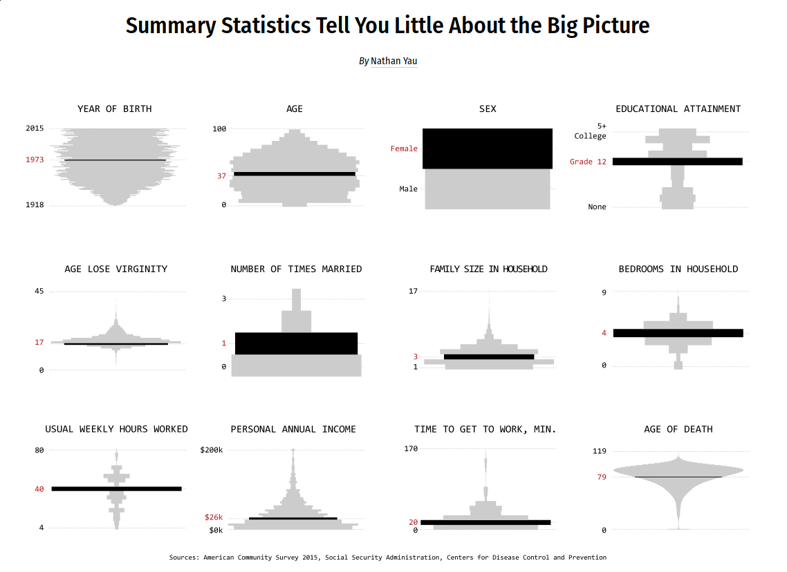

Mean, median, and mode. These are the first things you learn about in your introductory statistics course. It’s often all you hear about when you see data in the news. People form policies for populations, based on the generalized numbers.

However, these summary statistics can only tell you so much about a dataset, which means you can only learn a limited amount about what the data represents — the people, places, and things.

If you’re the one who consumes the data, you should wonder what the means and medians actually represent. If you’re the one who analyzes the data, spend time with the most granular that time and resources allow for. Something more interesting will almost always come out of it.

